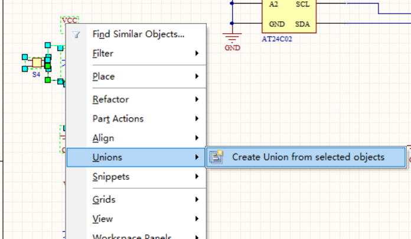
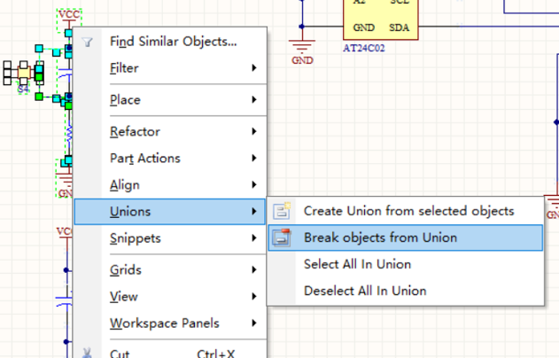
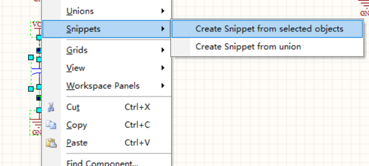
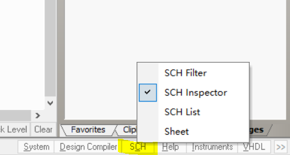
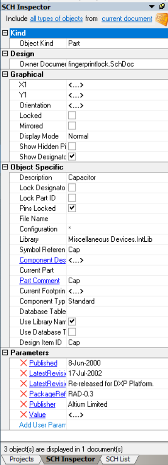
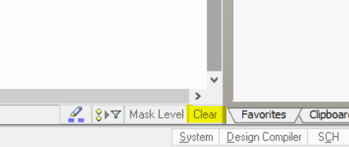

# AltiumDesigner9.4_tutorials  
# Tips  
|操作|作用|
|----|----|
|Ctrl+鼠标左键单击|drag（拖动元件时不断开连线）|
|鼠标左键单击|move（拖动元件时断开连线）|
|Ctrl+滚轮|缩放|
|滚轮|上下移动|
|Shift+滚轮|左右移动|
|按住鼠标右键，拖动鼠标|拖拽原理图|
|Tools -> Annotate Schematics|元件自动编号|
|Shift+S|仅显示当前层连线（再按一次恢复）|
|T+E,默认设置，单击OK|补泪滴|
|Design -> Make Schematic Library ->保存|从已有的原理图生成原理图库（.SCHLIB文件）|
|Design -> Netlist For Project ->protel|生成网表|
|Report-> Bill of Materials->Template选择合适模板->export（导出）|生成元件清单|
|Unknown Pin：design->netlist->edit net->删除所有net|
|画PCBDOC，快捷键EOS设置坐标原点，PT连导线|
# 创建联合体Union  
选中一小块独立的电路，鼠标右键  之后整块电路可以作为一个整体进行拖动 但如果你先选中了联合体中的某一个元件，再进行拖动，则为单独拖动该元件  
逆向操作：break   
# 创建电路模块Snippet
选中一小块独立的电路，鼠标右键  重命名并选择存放地址，添加注释，点击OK   
调用Snippet：点击System-> Snippets  双击所需要的Snippets放置到电路中   
# 更改元件封装  
点击Tools ->Footprint Manager……  在左边选中某个元件后，在右边列出的可用封装中选中某一个  鼠标右击，选择set as current  面板右下角点击Accept Changes  然后依次点击Validate Changes和Execute Changes 
# 批量更改元件封装（以电容为例）  
选中一个电容，鼠标右击，点击第一个Find Similar Objects……  弹出对话框，修改右边一列以更改查找条件，例如需要查找所有RAD-0.3封装的电容，如图修改两处，点击OK  图中高亮显示匹配上的元件，按住shift键，单击选中需要修改的元件（或者Ctrl+A选中所有）  以上是用查找的方式选中所有元件，如果你对原理图足够熟悉，也可按住shift键，一个一个单击元件选中所有电容  
如图打开SCH Inspector面板   如图修改Current Footprint参数为RAD-0.4，回车  点clear，清除原理图中的蒙版  此时，原理图中所有选中的电容封装都已更改为RAD-0.4，同理也可修改元件的容值等其他参数  

