# ISE14.7_tutorials  

    打开ISE14.7  
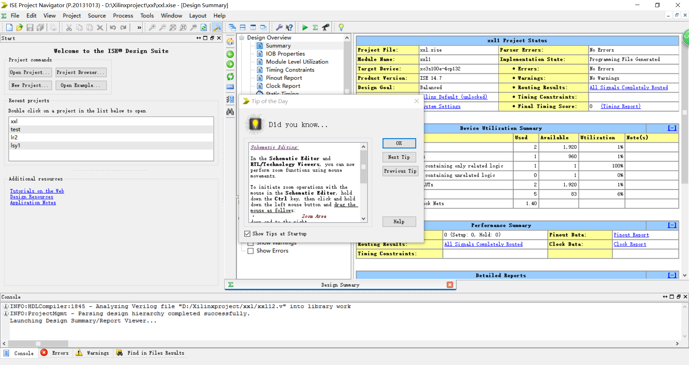  
---
    点击New Project,新建项目，命名（例如hope），点击Next  
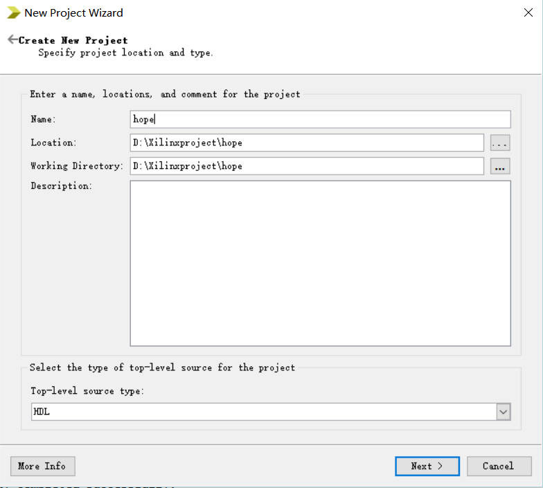  
---
    选择和所用FPGA板匹配的参数：Spartan3E, XC3S100E, CP132, -4,点击next，finish.
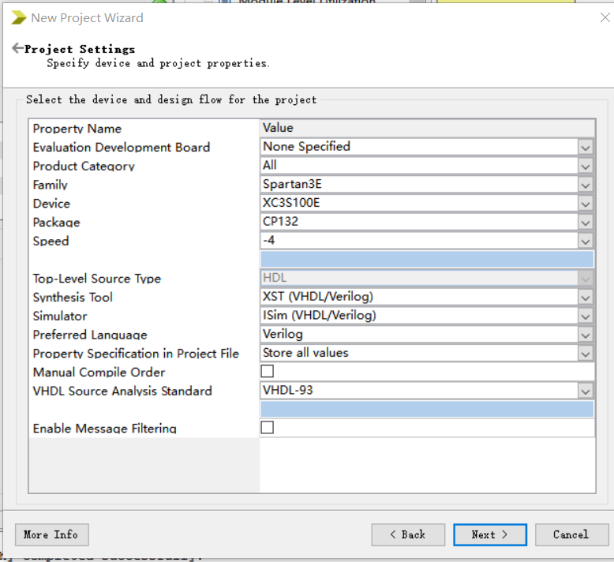  

    点中xc3s100e-4cp132,鼠标右键，点击New Source，添加文件，点击Schematic，命名（例如hope1），next。。。


    左边栏中选择symbols，在symbols栏中选择电路元件（例如and2）点击后
    可在右边区域放置，连接电路图，添加输入端、输出端
    点击左侧栏“abc”或双击端口更改名称,结束后注意保存!  


    （在design栏下）添加文件，选择Verilog Text Fixture,命名（如hope2），next， next，finish  


    用Verilog语言编写测试台文件，（有时会出现输入输出变量名未定义的情况，这时应手动定义：reg A0…wire B0…）  
    在endif下添加代码

```Verilog
initial
	  begin
	  A0=0;A1=0;A2=0;
	  #400;$stop;
	 end
	  always #50 A0=~A0;
	  always #100 A1=~A1;
	  always #200 A2=~A2;
      //注意变量名应与之前端口名对应！完成后点击保存
```
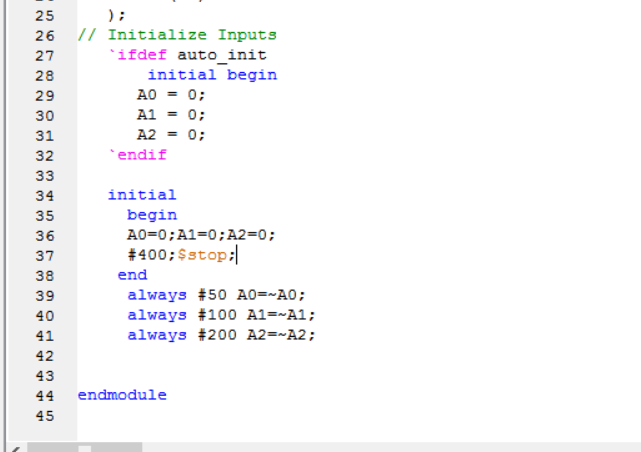
```Verilog
// Verilog test fixture created from schematic D:\Xilinxproject\xxl\xxl1.sch - Sun Oct 08 23:39:42 2017
 
`timescale 1ns / 1ps
 
module xxl1_xxl1_sch_tb();
 
// Inputs
   reg A0;
   reg A1;
   reg A2;
 
// Output
   wire B0;
   wire B1;
 
// Bidirs
// Instantiate the UUT
   xxl1 UUT (
		.A0(A0), 
		.A1(A1), 
		.A2(A2), 
		.B0(B0), 
		.B1(B1)
   );
// Initialize Inputs
   `ifdef auto_init
       initial begin
		A0 = 0;
		A1 = 0;
		A2 = 0;
   `endif
		initial
	  begin
	  A0=0;A1=0;A2=0;
	  #400;$stop;
	 end
	  always #50 A0=~A0;
	  always #100 A1=~A1;
	  always #200 A2=~A2;
endmodule
```

    在design栏内选中Simulation，下拉框内选择Behavioral，进行功能仿真
    （或者Post-Route,进行时序仿真）点中hope2.v文件，在Processes栏内双击Behavioral Check Syntax，进行语法检查
    打钩后说明检查通过，可开始进行仿真，双击Simulate Behavioral Model
    Console栏里显示completed successfully说明仿真成功，会自动打开Isim界面
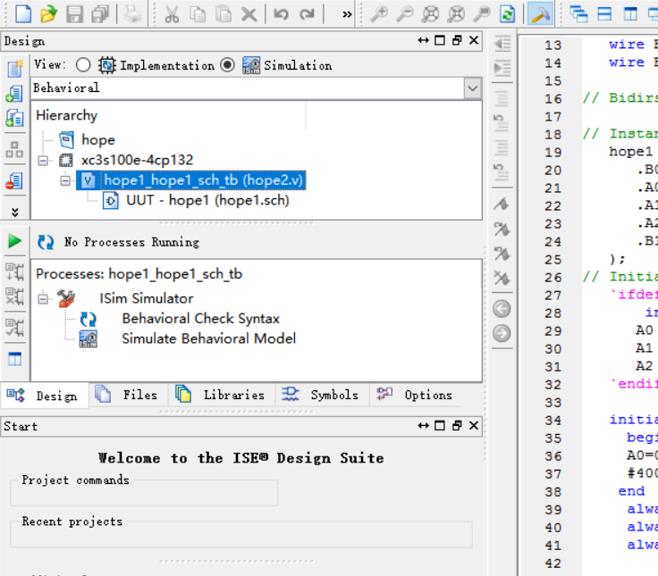


    在右边代码框下栏选择Default.wcfg点击zoom to full view（左列第三个图标）以调整大小 点击变量名并拖动，可改变其位置
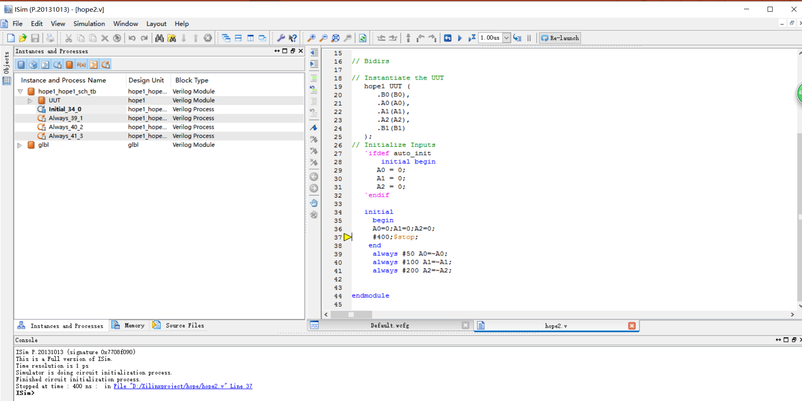
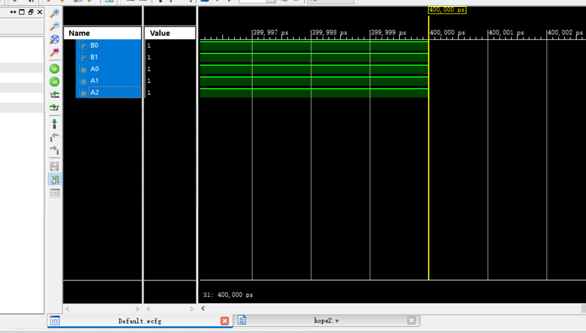
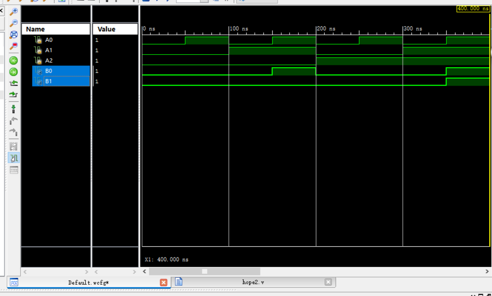

    观察波形图，确认无误后可点击保存，或不保存也无所谓，直接退出
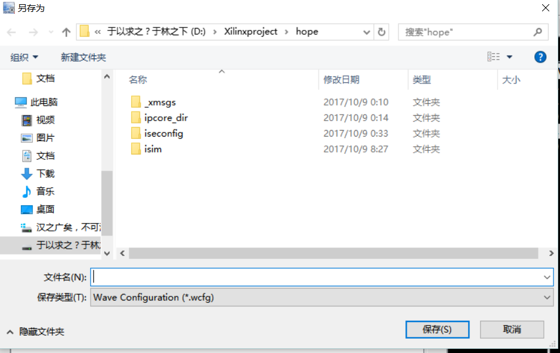

    回到ISE14.7，在design栏下，点击Implementation，展开processes栏中的User Constraints，
    双击I/O Pin Planning (PlanAhead)-Pre-Synthesis打开planahead14.7进行管脚分配
    展开Scalar Ports，在第4列中输入FPGA板中的管脚名称（如N3、E2、F3、G1、P4）,后面小正方形内会自动打钩（注意查看）保存后退出
    在ISE14.7中双击Generate Programming File，生成编程文件（.bit）
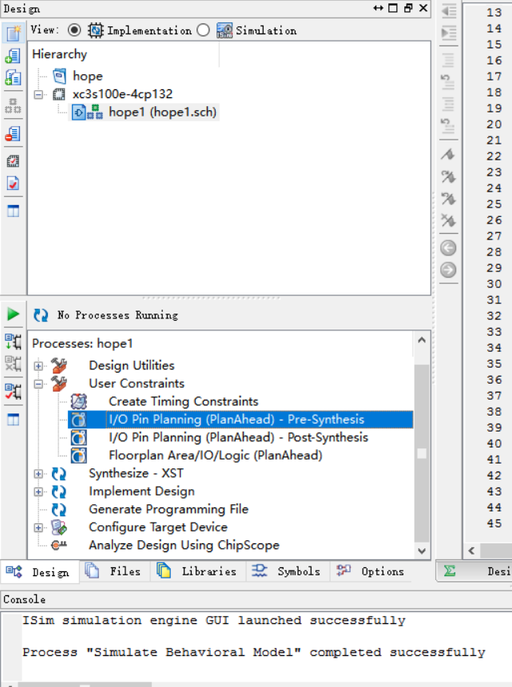
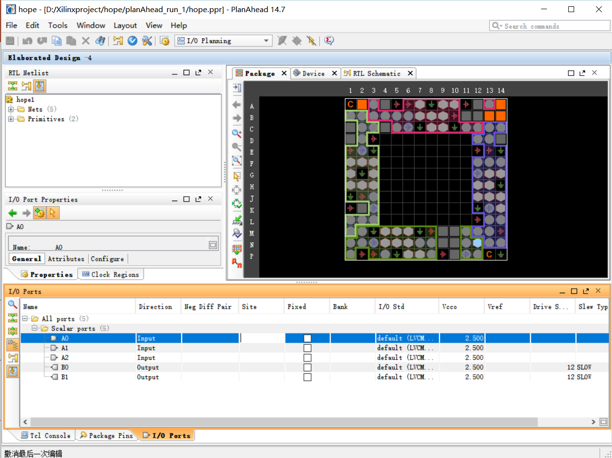

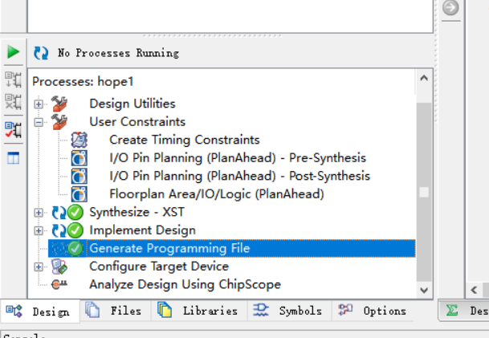

    将FPGA板连入电脑，打开板子总开关，打开Adept软件
    点击第一行Browse，打开hope项目，打开生成的 (.bit)文件，点“是”，点击Program
    电路就下载到了FPGA板，可通过相应开关控制二极管的亮暗
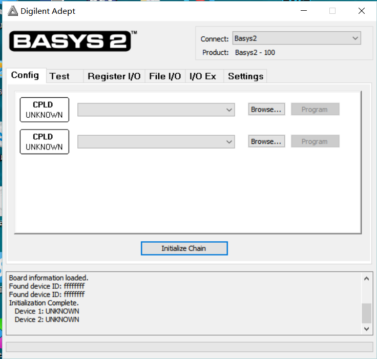
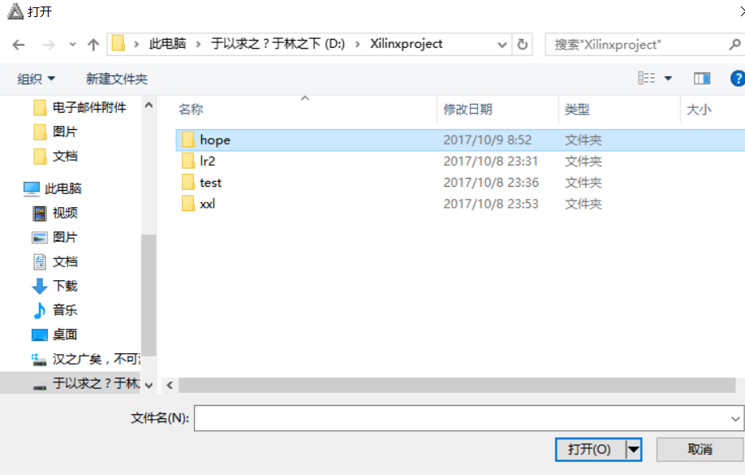

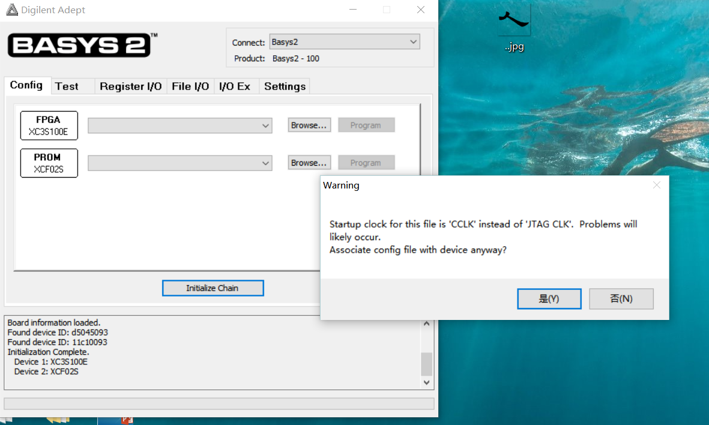
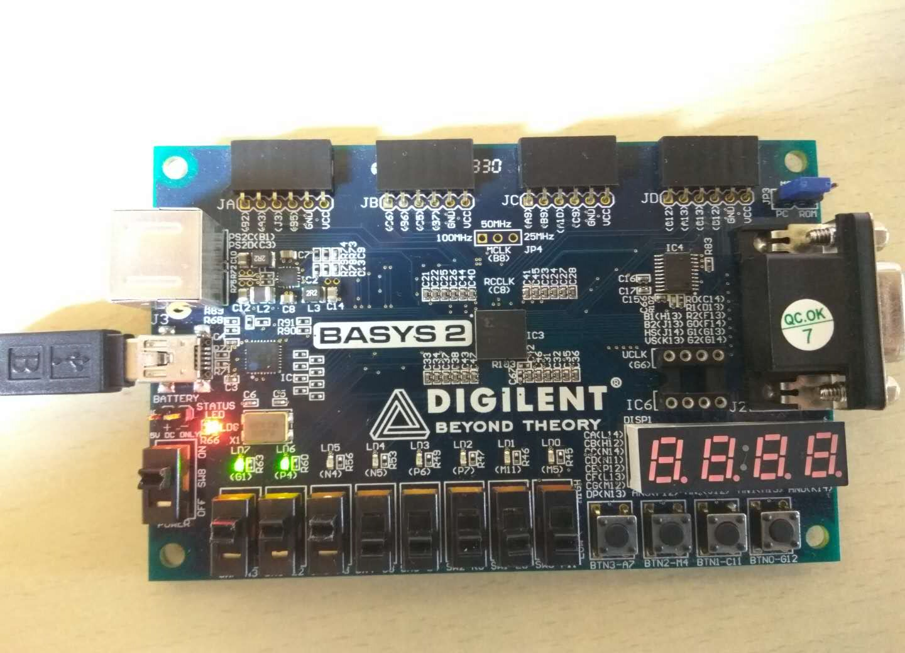
