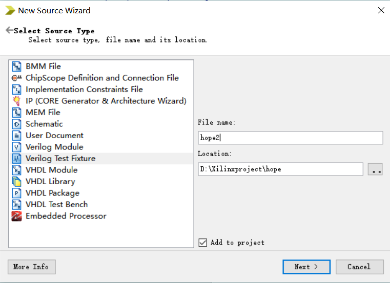

# ISE14.7_tutorials  

    打开ISE14.7  
  

    点击New Project,新建项目，命名（例如hope），点击Next  
  

    选择和所用FPGA板匹配的参数：Spartan3E, XC3S100E, CP132, -4,点击next，finish.
  

    点中xc3s100e-4cp132,鼠标右键，点击New Source，添加文件，点击Schematic，命名（例如hope1），next。。。


    左边栏中选择symbols，在symbols栏中选择电路元件（例如and2）点击后
    可在右边区域放置，连接电路图，添加输入端、输出端
    点击左侧栏“abc”或双击端口更改名称,结束后注意保存!  


    （在design栏下）添加文件，选择Verilog Text Fixture,命名（如hope2），next， next，finish  



    用Verilog语言编写测试台文件，（有时会出现输入输出变量名未定义的情况，这时应手动定义：reg A0…wire B0…）  
    在endif下添加代码

```Verilog
initial
	  begin
	  A0=0;A1=0;A2=0;
	  #400;$stop;
	 end
	  always #50 A0=~A0;
	  always #100 A1=~A1;
	  always #200 A2=~A2;
```
      //注意变量名应与之前端口名对应！完成后点击保存

```Verilog
// Verilog test fixture created from schematic D:\Xilinxproject\xxl\xxl1.sch - Sun Oct 08 23:39:42 2017
 
`timescale 1ns / 1ps
 
module xxl1_xxl1_sch_tb();
 
// Inputs
   reg A0;
   reg A1;
   reg A2;
 
// Output
   wire B0;
   wire B1;
 
// Bidirs
// Instantiate the UUT
   xxl1 UUT (
		.A0(A0), 
		.A1(A1), 
		.A2(A2), 
		.B0(B0), 
		.B1(B1)
   );
// Initialize Inputs
   `ifdef auto_init
       initial begin
		A0 = 0;
		A1 = 0;
		A2 = 0;
   `endif
		initial
	  begin
	  A0=0;A1=0;A2=0;
	  #400;$stop;
	 end
	  always #50 A0=~A0;
	  always #100 A1=~A1;
	  always #200 A2=~A2;
endmodule
```
erty
